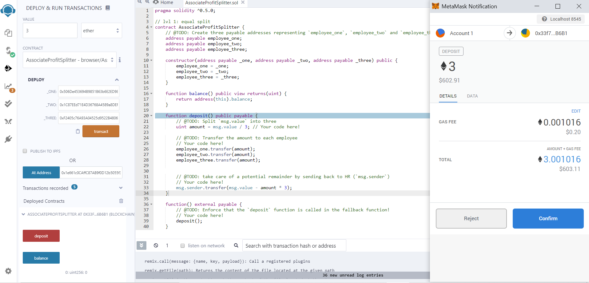
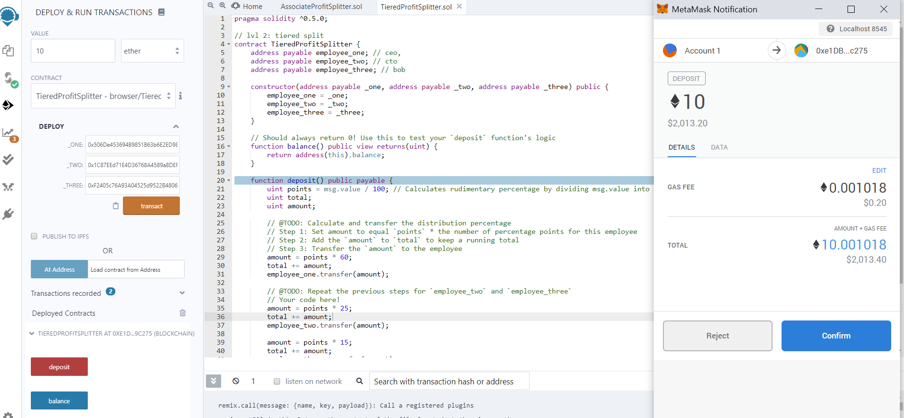
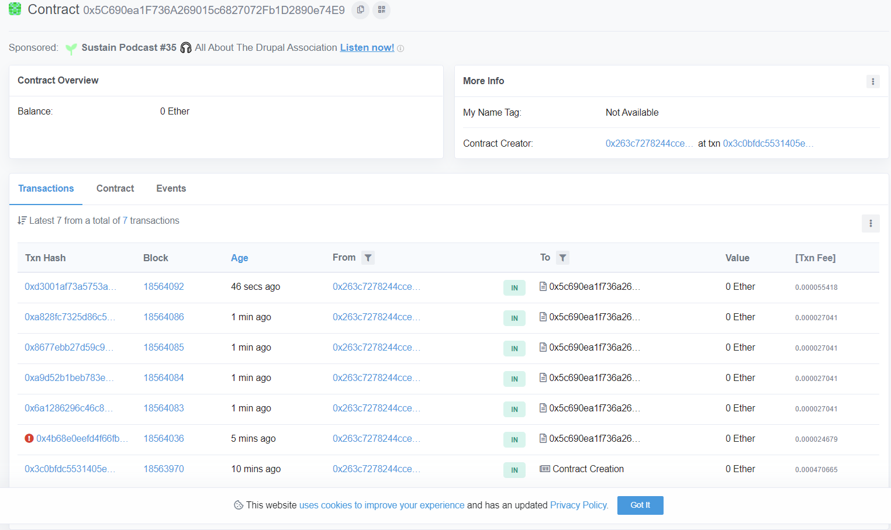

# Introduction To Solidity
## Overview
---
The purpose of this assigment is to develop smart contracts with `Solidity` to automate some company finances, focusing on employee incentive programs. Each contract is deployed and tested on the local network using the following tools:
* Ganache
* MetaMask
* Remix IDE

One contract is deployed onto the Kovan testnet to demostrate functionality. It should be noted that once a contract demostrates succesful transactions within the local testnet, it can also be deployed onto the Kovan testnet. All transactions can be reviewed within Remix or MetaMask, but I will also use [Etherscan](https://kovan.etherscan.io/) to explore how smart contracts behave in a blockchain. 

The smart contracts used in this assignment serve as demostration for how blockchain technology can be used to increase transparecy, and make accounting and auditing practically automatic. Furthermore, these contracts use constructors to declare state variables. This makes the code reusable and more secure. 

## The Associate Profit Splitter Contract
This contract accepts Ether and distributes it equally to three employes. Anyleft over Ether is sent back to `msg.sender`, the contract caller. A fallback function is added to prevent any Ether from being locked in the contract. If random Ether is sent into the contract without any associated data, a function, the fallback calls the deposit function. The employees are the beneficiaries as they are awarded all Ether sent to this contract address. 
###### Transaction on private testnet

## The Tiered Profit Splitter Contract
The idea behind this contract is similar to the one discussed above. All Ether deposited into the contract address is split and transfered the three employees. The big difference is that instead of dividing it equally, the contract uses a percentages system to distribute the currency depending on the employee's position level. 
###### Transaction on private testnet

## The Deferred Equity Plan
This contract is very different than the previous two. There is no Ether being deposited or transfered. The only time Ether comes into play is when discussing gas estimates/prices. In this program employees are awarded 100 shares,  equity, instead of Ether. However, equity is not awarded upfront. Intead the company has a four year vesting period in place. The employee will recieve 250 shares for every full year with company until it amounts to a total of 1000 shares.  

This example strengthens the idea that Etherium is a turing complete machine. Smart contracts can be coded to automate all kinds of functions. 

###### Transactions on the Kovan Testnet

 
